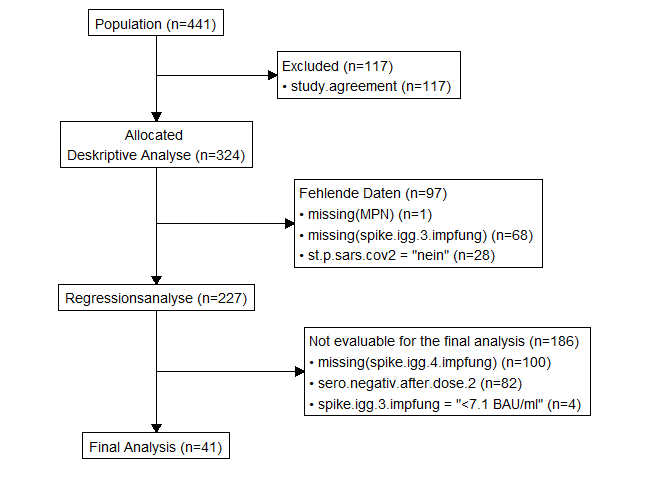

stp25tools
================
2024-10-29

<!-- output: -->
<!--   html_document: -->
<!--     toc: true -->
<!--     toc_float: true -->
<!-- github_document -->

The stp25tools package provides tools for data wrangling and statistical
transformations.

<!-- badges: start -->

[](https://www.tidyverse.org/lifecycle/#experimental)
[](https://CRAN.R-project.org/package=stp25stat2)
<!-- badges: end -->

## Funktionen

- Pivot-Functions: *Long(), Wide(), Dapply(), dapply2(), transpose2()*

- Merging `data.frame`: *Merge2, Rbind2, combine_data_frame*

- Convert object to `data.frame`: *fix_to_df, fix_to_tibble, list_to_df*

- Create vectors for accessing `data frames`: *Cs, XLS, paste_names*

- Wrap string: *wrap_string*

- Add element to vector or lists: *add_to, add_row_df*

- Internal function in stp25stat2 used to prepare data with formula:
  *prepare_data2, print*

- Transform vectors: *as_numeric, as_factor, factor2, as_cut,
  as_logical, rev.factor,as_rev, cat_bmi*

- Import data: *get_data*

- Add and transform missing data: *na_approx, auto_trans*

- Managing labels: *Label, delet_label, get_label, set_label*

- Cleaning Data Frame and strings: *clean_names, cleansing_umlaute,
  cleansing_umlaute2*

- Calculation operations: *auc_trapezoid*

<!-- Attaching package: ‘stp25tools’ -->
<!-- The following objects are masked from ‘package:stp25aggregate’: -->
<!--     get_label, Label, set_label, wrap_label, XLS -->

## Transform vectors

### Factor (factor2)

``` r
sex <- factor2(c(1,0,0,0,1,1,0), 
        male = 1, female = 0)
 sex
```

    ## [1] male   female female female male   male   female
    ## Levels: male female

### reorder2

``` r
 x <-
c(
  rep(1, 21),rep(2, 120),rep(3, 28),rep(4, 4),rep(5, 56),
  rep(6, 2),rep(7, 92),rep(8, 42),rep(9, 74),rep(10, 20)
)

x <- factor(x, 1:10, letters[1:10])
table(x)
```

    ## x
    ##   a   b   c   d   e   f   g   h   i   j 
    ##  21 120  28   4  56   2  92  42  74  20

``` r
table(reorder2(x))
```

    ## 
    ##   b   g   i   e   h   c   a   j   d   f 
    ## 120  92  74  56  42  28  21  20   4   2

``` r
table(reorder2(x, threshold = 30))
```

    ## 
    ##     b     g     i     e     h Other 
    ##   120    92    74    56    42    75

### Numeric

``` r
x <-
  c("3,6",  "> 15100",  "+1",  "-1",
    "$10 -> expensive", "cheap: $2.50", "free $0 !!",
    "699.91  ",  " 228.4031.9 ",
    "",  NA,  "hallo1",  "-77"
  )
 
 
cbind(
  stp = as_numeric(x,  na.string = c("-77")),
  fct = as_numeric(factor(x)),
  rdr = readr::parse_number(x,  na = c("-77"))
)
```

    ##              stp        fct        rdr
    ##  [1,]     3.6000     3.6000    36.0000
    ##  [2,] 15100.0000 15100.0000 15100.0000
    ##  [3,]     1.0000     1.0000     1.0000
    ##  [4,]    -1.0000    -1.0000    -1.0000
    ##  [5,]    10.0000    10.0000    10.0000
    ##  [6,]     2.5000     2.5000     2.5000
    ##  [7,]     0.0000     0.0000     0.0000
    ##  [8,]   699.9100   699.9100   699.9100
    ##  [9,]   228.4031   228.4031   228.4031
    ## [10,]         NA         NA         NA
    ## [11,]         NA         NA         NA
    ## [12,]     1.0000     1.0000     1.0000
    ## [13,]         NA   -77.0000         NA

## Get Data

Works internally with the following functions:

- Excel-File xlsx: `readxl::read_excel(file, sheet, skip, range)`
- CSV-File:
  `read.table(file, header, sep, quote, dec, na.strings, skip, fill, comment.char)`
- SPSS-DATA sav: `haven::read_sav(file, encoding,  user_na)`
- Text-file: `read.text2(file, dec)`

### Direct import from text

``` r
dat <-
  get_data("
sex treatment control
m  2 3
f  3 4
", 
tabel_expand = TRUE,
id.vars = 1)

xtabs(~ sex + value, dat)
```

    ##    value
    ## sex control treatment
    ##   f       4         3
    ##   m       3         2

``` r
dat <- 
  get_data(
"sex treatment  neg  pos
f   KG          3   3
f   UG          4   5
m   KG          5   4
m   UG          4   2
",
  tabel_expand = TRUE,
  id.vars = 1:2,
  value = "befund"
)

ftable(xtabs(~ sex + treatment + befund, dat))
```

    ##               befund neg pos
    ## sex treatment               
    ## f   KG                 3   3
    ##     UG                 4   5
    ## m   KG                 5   4
    ##     UG                 4   2

### Data File Import

``` r
if( file.exists("R/dummy.csv")) {
# get_data("R/dummy.csv", dec = ",", na.strings = "-", skip=1, label=1)
# get_data("R/dummy.xlsx", na.strings = "-")
 get_data("R/dummy.xlsx")
 x <- get_data("R/dummy.sav")
 get_label(x)[1:4]
}
```

### Get / Set a variable label

Managing labels: `Label`, `delet_label`, `get_label`, `set_label`
alternativ function `labelled::set_variable_labels`

### Codebook Generate a data dictionnary

Save data and reconstruct from codebook

``` r
 save_data(dat, "demo.xlsx", include.codebook=TRUE)
```

    ## Writing file to:
    ## C:/Users/wpete/Dropbox/3_Forschung/R-Project/stp25tools/demo.xlsx

``` r
 DF2 <- use_codebook(file = "demo.xlsx")
```

    ## 
    ## (1)
    ## Use data from file demo.xlsx 
    ## # A tibble: 6 × 4
    ##   sex   treatment Var1  befund
    ##   <chr> <chr>     <chr> <chr> 
    ## 1 f     KG        f+KG  neg   
    ## 2 f     KG        f+KG  neg   
    ## 3 f     KG        f+KG  neg   
    ## 4 f     UG        f+UG  neg   
    ## 5 f     UG        f+UG  neg   
    ## 6 f     UG        f+UG  neg   
    ## 
    ## (2)
    ## Label and levels from file:
    ##  demo.xlsx 
    ## # A tibble: 4 × 3
    ##   names     label     value.labels                     
    ##   <chr>     <chr>     <chr>                            
    ## 1 sex       sex       factor: f | m                    
    ## 2 treatment treatment factor: KG | UG                  
    ## 3 Var1      Var1      factor: f+KG | f+UG | m+KG | m+UG
    ## 4 befund    befund    factor: neg | pos                
    ## 
    ## (3) I am going to work on the value.labels
    ## 
    ##  sex : character -> factor
    ##  treatment : character -> factor
    ##  Var1 : character -> factor
    ##  befund : character -> factor
    ## 
    ## (4) 
    ## I am in the process of label restoration.

``` r
codebook(DF2)
```

    ##               names     label                      value.labels
    ## sex             sex       sex                     factor: f | m
    ## treatment treatment treatment                   factor: KG | UG
    ## Var1           Var1      Var1 factor: f+KG | f+UG | m+KG | m+UG
    ## befund       befund    befund                 factor: neg | pos

Die Funktion `look_for` macht zwar nicht dasselbe, kann aber nützlich
sein, wenn eine Variable gesucht wird.

``` r
labelled::look_for(DF2, "KG")
```

    ##  pos variable  label     col_type missing values
    ##  2   treatment treatment fct      0       KG    
    ##                                           UG    
    ##  3   Var1      Var1      fct      0       f+KG  
    ##                                           f+UG  
    ##                                           m+KG  
    ##                                           m+UG

### Filter + Consort-Plot

Works internally with the following functions:

- subset2: `base::subset` + label_data_frame
- filter2: `dplyr::filter` + info what was filtered

``` r
airquality2 <-
  airquality |> Label(Ozone = "Ozone in ppm", Temp = "Temperatur in °C")

str(subset2(airquality2, Temp > 80, select = c(Ozone, Temp)))
```

    ## 'data.frame':    68 obs. of  2 variables:
    ##  $ Ozone: int  45 NA NA 29 NA 71 39 NA NA 23 ...
    ##   ..- attr(*, "label")= chr "Ozone in ppm"
    ##  $ Temp : int  81 84 85 82 87 90 87 93 92 82 ...
    ##   ..- attr(*, "label")= chr "Temperatur in °C"

``` r
str(dplyr::filter(airquality2, Temp > 80))
```

    ## 'data.frame':    68 obs. of  6 variables:
    ##  $ Ozone  : int  45 NA NA 29 NA 71 39 NA NA 23 ...
    ##   ..- attr(*, "label")= chr "Ozone in ppm"
    ##  $ Solar.R: int  252 186 220 127 273 291 323 259 250 148 ...
    ##  $ Wind   : num  14.9 9.2 8.6 9.7 6.9 13.8 11.5 10.9 9.2 8 ...
    ##  $ Temp   : int  81 84 85 82 87 90 87 93 92 82 ...
    ##   ..- attr(*, "label")= chr "Temperatur in °C"
    ##  $ Month  : int  5 6 6 6 6 6 6 6 6 6 ...
    ##  $ Day    : int  29 4 5 7 8 9 10 11 12 13 ...

``` r
dat <- filter2(airquality2, Temp > 80)
str(dat)
```

    ## 'data.frame':    68 obs. of  6 variables:
    ##  $ Ozone  : int  45 NA NA 29 NA 71 39 NA NA 23 ...
    ##   ..- attr(*, "label")= chr "Ozone in ppm"
    ##  $ Solar.R: int  252 186 220 127 273 291 323 259 250 148 ...
    ##  $ Wind   : num  14.9 9.2 8.6 9.7 6.9 13.8 11.5 10.9 9.2 8 ...
    ##  $ Temp   : int  81 84 85 82 87 90 87 93 92 82 ...
    ##   ..- attr(*, "label")= chr "Temperatur in °C"
    ##  $ Month  : int  5 6 6 6 6 6 6 6 6 6 ...
    ##  $ Day    : int  29 4 5 7 8 9 10 11 12 13 ...
    ##  - attr(*, "filter")= attritin [2 × 6] (S3: attrition/tbl_df/tbl/data.frame)
    ##   ..$ Criteria     : chr [1:2] "Total cohort size" "1. Filter"
    ##   ..$ Condition    : chr [1:2] "none" "Temp > 80"
    ##   ..$ Remaining.N  : int [1:2] 153 68
    ##   ..$ Remaining.prc: num [1:2] 100 44.4
    ##   ..$ Excluded.N   : int [1:2] 0 85
    ##   ..$ Excluded.prc : num [1:2] 0 55.6

``` r
# simple_consort_plot(dat)
attr(dat, "filter")
```

    ## # A tibble: 2 × 6
    ##   Criteria          Condition Remaining.N Remaining.prc Excluded.N Excluded.prc
    ##   <chr>             <chr>           <int>         <dbl>      <int>        <dbl>
    ## 1 Total cohort size none              153         100            0          0  
    ## 2 1. Filter         Temp > 80          68          44.4         85         55.6

``` r
#require(stp25stat2)
#require(stp25tools)

data(DFdummy, package = "stp25data")

DF1 <- DFdummy |> 
  filter2(study.agreement)

attr(DF1, "filter")
```

    ## # A tibble: 2 × 6
    ##   Criteria          Condition  Remaining.N Remaining.prc Excluded.N Excluded.prc
    ##   <chr>             <chr>            <int>         <dbl>      <int>        <dbl>
    ## 1 Total cohort size none               441         100            0          0  
    ## 2 1. Filter         study.agr…         324          73.5        117         26.5

``` r
DF2 <- DF1 |> filter2(
  st.p.sars.cov2 == "nein",
  !is.na(spike.igg.3.impfung),
  !is.na(MPN)

)

DF3 <- DF2 |> filter2(
  study.agreement,
  sero.negativ.after.dose.2,
  !is.na(spike.igg.3.impfung),
  !is.na(spike.igg.4.impfung),
  spike.igg.3.impfung == "<7.1 BAU/ml"
)
```

``` r
require(consort)
```

    ## Loading required package: consort

``` r
dat <- prepare_consort(DF1, DF2, DF3)
out <- consort_plot(
  data = dat,
  orders = c(
    Trial.Nr   = "Population",
    Condition.1           = "Excluded",
    Trial.Nr     = "Allocated \nDeskriptive Analyse",
    Condition.2    =    "Fehlende Daten",
    Trial.Nr = "Regressionsanalyse",
    Condition.3    = "Not evaluable for the final analysis",
    Trial.Nr = "Final Analysis"
  ),
  side_box = c("Condition.1", "Condition.2", "Condition.3"),
  cex = 0.9
)


plot(out)
```

<!-- -->

## Transpose

This is an extension of `tidyr::pivot_longer` and `tidyr::pivot_wider`,
with added functionality using formulas.

``` r
DF_sprk <- data.frame(
  Laborwert = gl(7,8,
    labels = c("Albumin","Amylase","Lipase","AST","ALT","Bilirubin","C.Peptid")),
  Treat = gl(2, 4, labels = c("Control", "Treat")),
  Time = gl(4, 1, labels = c("t0", "t1", "t2", "t4")),
  x = rnorm(7 * 8)
) |>
  stp25stat2::Summarise(x ~ Laborwert + Time + Treat,
            fun = mean,
            value = "x")
```

``` r
DF_sprk
```

    ## # A tibble: 56 × 5
    ##    Laborwert Time  Treat   variable      x
    ##    <fct>     <fct> <fct>   <fct>     <dbl>
    ##  1 Albumin   t0    Control x         1.03 
    ##  2 Albumin   t1    Control x         0.674
    ##  3 Albumin   t2    Control x        -1.37 
    ##  4 Albumin   t4    Control x        -0.446
    ##  5 Albumin   t0    Treat   x         0.489
    ##  6 Albumin   t1    Treat   x         0.349
    ##  7 Albumin   t2    Treat   x         0.875
    ##  8 Albumin   t4    Treat   x        -1.01 
    ##  9 Amylase   t0    Control x        -0.407
    ## 10 Amylase   t1    Control x        -1.08 
    ## # ℹ 46 more rows

``` r
DF<- Wide(DF_sprk[-4], Time ) |> Wide(Laborwert , t0, t1, t2, t4)
```

    ## Using x as value column: use value to override.

``` r
#' So einen DF bekomme ich meist
DF
```

    ## # A tibble: 2 × 29
    ##   Treat   t0_Albumin t0_Amylase t0_Lipase t0_AST t0_ALT t0_Bilirubin t0_C.Peptid
    ##   <fct>        <dbl>      <dbl>     <dbl>  <dbl>  <dbl>        <dbl>       <dbl>
    ## 1 Control      1.03      -0.407    0.0547  0.254 -0.656       1.35         0.450
    ## 2 Treat        0.489     -1.64     1.01   -0.801  0.469       0.0203       0.312
    ## # ℹ 21 more variables: t1_Albumin <dbl>, t1_Amylase <dbl>, t1_Lipase <dbl>,
    ## #   t1_AST <dbl>, t1_ALT <dbl>, t1_Bilirubin <dbl>, t1_C.Peptid <dbl>,
    ## #   t2_Albumin <dbl>, t2_Amylase <dbl>, t2_Lipase <dbl>, t2_AST <dbl>,
    ## #   t2_ALT <dbl>, t2_Bilirubin <dbl>, t2_C.Peptid <dbl>, t4_Albumin <dbl>,
    ## #   t4_Amylase <dbl>, t4_Lipase <dbl>, t4_AST <dbl>, t4_ALT <dbl>,
    ## #   t4_Bilirubin <dbl>, t4_C.Peptid <dbl>

``` r
#' Und das brauch ich zum Rechnen
DF |> Long(. ~ Treat)  |> tidyr::separate(variable, c("Time", "Laborwert"), sep="_")
```

    ## # A tibble: 56 × 4
    ##    Treat   Time  Laborwert   value
    ##    <fct>   <chr> <chr>       <dbl>
    ##  1 Control t0    Albumin    1.03  
    ##  2 Control t0    Amylase   -0.407 
    ##  3 Control t0    Lipase     0.0547
    ##  4 Control t0    AST        0.254 
    ##  5 Control t0    ALT       -0.656 
    ##  6 Control t0    Bilirubin  1.35  
    ##  7 Control t0    C.Peptid   0.450 
    ##  8 Control t1    Albumin    0.674 
    ##  9 Control t1    Amylase   -1.08  
    ## 10 Control t1    Lipase     0.828 
    ## # ℹ 46 more rows

### Wide

Works internally with the function `tidyr::pivot_wider`, with added
functionality using formulas.

``` r
dat
```

    ##   month student  A B
    ## 1     1     Amy 19 6
    ## 2     2     Amy 27 7
    ## 3     3     Amy 16 8
    ## 4     1     Bob 28 5
    ## 5     2     Bob 10 6
    ## 6     3     Bob 29 7

``` r
dat |> 
  Wide(student,  A)
```

    ## # A tibble: 6 × 4
    ##   month     B   Amy   Bob
    ##   <int> <dbl> <dbl> <dbl>
    ## 1     1     6    19    NA
    ## 2     2     7    27    NA
    ## 3     3     8    16    NA
    ## 4     1     5    NA    28
    ## 5     2     6    NA    10
    ## 6     3     7    NA    29

``` r
dat |> 
  tidyr::pivot_wider(names_from = student, 
                           values_from = A)
```

    ## # A tibble: 6 × 4
    ##   month     B   Amy   Bob
    ##   <int> <dbl> <dbl> <dbl>
    ## 1     1     6    19    NA
    ## 2     2     7    27    NA
    ## 3     3     8    16    NA
    ## 4     1     5    NA    28
    ## 5     2     6    NA    10
    ## 6     3     7    NA    29

``` r
#' dat |> tidyr::pivot_wider(names_from = student, A)
#' error Column `value` doesn't exist.

dat |> 
  tidyr::pivot_wider(names_from = student, 
                    values_from = A, 
                    values_fill = 0)
```

    ## # A tibble: 6 × 4
    ##   month     B   Amy   Bob
    ##   <int> <dbl> <dbl> <dbl>
    ## 1     1     6    19     0
    ## 2     2     7    27     0
    ## 3     3     8    16     0
    ## 4     1     5     0    28
    ## 5     2     6     0    10
    ## 6     3     7     0    29

``` r
# mehere values
dat |> tidyr::pivot_wider(names_from = student, 
                           values_from = c(A, B))
```

    ## # A tibble: 3 × 5
    ##   month A_Amy A_Bob B_Amy B_Bob
    ##   <int> <dbl> <dbl> <dbl> <dbl>
    ## 1     1    19    28     6     5
    ## 2     2    27    10     7     6
    ## 3     3    16    29     8     7

``` r
dat |> Wide(month ~ student, A, B)
```

    ## # A tibble: 6 × 4
    ##   which month   Amy   Bob
    ##   <fct> <int> <dbl> <dbl>
    ## 1 A         1    19    28
    ## 2 A         2    27    10
    ## 3 A         3    16    29
    ## 4 B         1     6     5
    ## 5 B         2     7     6
    ## 6 B         3     8     7

Formulas are evaluated in two ways

1.  `Wide(A ~ student)` on the left `values_from` on the right
    `names_from`
2.  `Wide(month ~ student, A)` now the output structure and is in the
    formula `names_from` will be handed over separately

``` r
dat |> Wide(A ~ student)
```

    ## # A tibble: 6 × 4
    ##   month     B   Amy   Bob
    ##   <int> <dbl> <dbl> <dbl>
    ## 1     1     6    19    NA
    ## 2     2     7    27    NA
    ## 3     3     8    16    NA
    ## 4     1     5    NA    28
    ## 5     2     6    NA    10
    ## 6     3     7    NA    29

``` r
dat |> Wide(A + B ~ student)
```

    ## # A tibble: 3 × 5
    ##   month A_Amy A_Bob B_Amy B_Bob
    ##   <int> <dbl> <dbl> <dbl> <dbl>
    ## 1     1    19    28     6     5
    ## 2     2    27    10     7     6
    ## 3     3    16    29     8     7

``` r
dat |> Wide(A + B ~ student + month)
```

    ## # A tibble: 1 × 12
    ##   A_Amy_1 A_Amy_2 A_Amy_3 A_Bob_1 A_Bob_2 A_Bob_3 B_Amy_1 B_Amy_2 B_Amy_3
    ##     <dbl>   <dbl>   <dbl>   <dbl>   <dbl>   <dbl>   <dbl>   <dbl>   <dbl>
    ## 1      19      27      16      28      10      29       6       7       8
    ## # ℹ 3 more variables: B_Bob_1 <dbl>, B_Bob_2 <dbl>, B_Bob_3 <dbl>

``` r
# dat |> Wide(A ~ student)
# dat |> Wide(A ~ student + month)

dat |> Wide(month ~ student, A)
```

    ## # A tibble: 3 × 3
    ##   month   Amy   Bob
    ##   <int> <dbl> <dbl>
    ## 1     1    19    28
    ## 2     2    27    10
    ## 3     3    16    29

``` r
dat |> Wide(month ~ student, A , B)
```

    ## # A tibble: 6 × 4
    ##   which month   Amy   Bob
    ##   <fct> <int> <dbl> <dbl>
    ## 1 A         1    19    28
    ## 2 A         2    27    10
    ## 3 A         3    16    29
    ## 4 B         1     6     5
    ## 5 B         2     7     6
    ## 6 B         3     8     7

### Long

Combining several variables into **one** long variable. Works internally
with the function `tidyr::pivot_longer`.

``` r
df2 <-  
dat |> Wide(student,  A, B)

df2  |> Long(A_Amy, A_Bob, B_Amy ,B_Bob, by =  ~ month) |> 
  tidyr::separate(variable , c('First', 'Last'))
```

    ## # A tibble: 12 × 4
    ##    month First Last  value
    ##    <int> <chr> <chr> <dbl>
    ##  1     1 A     Amy      19
    ##  2     1 A     Bob      28
    ##  3     1 B     Amy       6
    ##  4     1 B     Bob       5
    ##  5     2 A     Amy      27
    ##  6     2 A     Bob      10
    ##  7     2 B     Amy       7
    ##  8     2 B     Bob       6
    ##  9     3 A     Amy      16
    ## 10     3 A     Bob      29
    ## 11     3 B     Amy       8
    ## 12     3 B     Bob       7

``` r
dat |>
  tidyr::gather(variable, value,-(month:student))
```

    ##    month student variable value
    ## 1      1     Amy        A    19
    ## 2      2     Amy        A    27
    ## 3      3     Amy        A    16
    ## 4      1     Bob        A    28
    ## 5      2     Bob        A    10
    ## 6      3     Bob        A    29
    ## 7      1     Amy        B     6
    ## 8      2     Amy        B     7
    ## 9      3     Amy        B     8
    ## 10     1     Bob        B     5
    ## 11     2     Bob        B     6
    ## 12     3     Bob        B     7

``` r
# relig_income |>
#   tidyr::pivot_longer(!religion, names_to = "income", values_to = "count")
# 
# dat |> Long(  A, B, by =  ~ month + student  )|>
#   tidyr::unite(temp, student, variable) |>
#   tidyr::spread(temp, value)
```

Combining several variables into **several** long variables. Works
internally with the function `base::rbind()`.

``` r
head(DF)
```

    ## # A tibble: 6 × 12
    ##      id group      age     a1     b1      c1     a2     b2      c2     a3     b3
    ##   <int> <fct>    <dbl>  <dbl>  <dbl>   <dbl>  <dbl>  <dbl>   <dbl>  <dbl>  <dbl>
    ## 1     1 Control  0.266  1.47  -0.326 -0.370  -0.204 -0.190 -0.694  -0.809 -0.563
    ## 2     2 Control  0.126  1.20   1.23   2.20    0.618  0.152 -0.214  -1.47   0.137
    ## 3     3 Control  0.838  1.28  -1.16   0.0848  0.141 -1.43  -1.33   -1.28   0.734
    ## 4     4 Control -1.09   0.350  0.818 -0.571   0.604 -1.19   2.37    2.18   0.788
    ## 5     5 Control -1.51  -0.232  0.759 -0.615  -0.570 -1.91  -1.05    1.75  -0.507
    ## 6     6 Control  0.983  0.178 -0.944 -0.313   1.98   1.78   0.0323 -0.536  0.176
    ## # ℹ 1 more variable: c3 <dbl>

``` r
#' das gleiche wie oben
#' DF |> Long( a1, a2, a3, by = ~ id + group + age)
#' Long( a1 + a2+ a3  ~ id + group + age, DF)

Long(
  DF,
  .list = list(
    t0 = c("a1", "b1", "c1"),
    t1 = c("a2", "b2", "c2"),
    t2 = c("a3", "b3", "c3")
  ),
  by =  ~ id + group + age,
  names = c("a", "b", "c"),
  key = "time"
)
```

    ## # A tibble: 48 × 7
    ##       id group      age time       a      b       c
    ##    <int> <fct>    <dbl> <chr>  <dbl>  <dbl>   <dbl>
    ##  1     1 Control  0.266 t0     1.47  -0.326 -0.370 
    ##  2     2 Control  0.126 t0     1.20   1.23   2.20  
    ##  3     3 Control  0.838 t0     1.28  -1.16   0.0848
    ##  4     4 Control -1.09  t0     0.350  0.818 -0.571 
    ##  5     5 Control -1.51  t0    -0.232  0.759 -0.615 
    ##  6     6 Control  0.983 t0     0.178 -0.944 -0.313 
    ##  7     7 Control -0.910 t0    -0.453  0.553  2.36  
    ##  8     8 Control  0.412 t0    -0.396  0.764  1.65  
    ##  9     9 Treat   -0.347 t0    -0.401  0.454 -0.499 
    ## 10    10 Treat   -0.579 t0    -0.507 -0.153 -1.14  
    ## # ℹ 38 more rows

Wenn die Variablen - Namen gut trennbar sind geht auch folgendes.

``` r
names(DF) <- c("id","group", "age","a.t1","b.t1","c.t1","a.t2","b.t2","c.t2","a.t3","b.t3","c.t3")

DF |> Long(.~ id + group + age)  |>
  tidyr::separate(variable, 
                  c( "Laborwert", "Time"), 
                  sep = "\\.") |>
  Wide(Laborwert)
```

    ## # A tibble: 48 × 7
    ##       id group      age Time       a      b        c
    ##    <int> <fct>    <dbl> <chr>  <dbl>  <dbl>    <dbl>
    ##  1     1 Control  0.266 t1     1.47  -0.326 -0.370  
    ##  2     1 Control  0.266 t2    -0.204 -0.190 -0.694  
    ##  3     1 Control  0.266 t3    -0.809 -0.563 -2.50   
    ##  4     2 Control  0.126 t1     1.20   1.23   2.20   
    ##  5     2 Control  0.126 t2     0.618  0.152 -0.214  
    ##  6     2 Control  0.126 t3    -1.47   0.137  0.00151
    ##  7     3 Control  0.838 t1     1.28  -1.16   0.0848 
    ##  8     3 Control  0.838 t2     0.141 -1.43  -1.33   
    ##  9     3 Control  0.838 t3    -1.28   0.734 -0.153  
    ## 10     4 Control -1.09  t1     0.350  0.818 -0.571  
    ## # ℹ 38 more rows

### Pivot-Transpose

``` r
dat
```

    ##   pos x y
    ## 1   A 1 3
    ## 2   B 2 4
    ## 3   C 3 5

``` r
transpose2(dat)
```

    ##   Item A B C
    ## x    x 1 2 3
    ## y    y 3 4 5

``` r
transpose2(
  dat,
  key = "Item",
  col.names = c("A-level", "C-level", "D-Level"),
  row.names = c("x-axis", "y-axis")
)
```

    ##     Item A-level C-level D-Level
    ## x x-axis       1       2       3
    ## y y-axis       3       4       5

### Rbind2()

Works internally with the function `dplyr::bind_rows`.

    Rbind2( ...,
            .id = "which",
            .names = NULL,
            .use.label = TRUE,
            include.rownames = FALSE

``` r
df1 <- data.frame(CustomerId = c(1:6), Product = c(rep("Oven", 3), rep("Television", 3))) |> 
  Label( Product = "Produkt")
df2 <- data.frame(CustomerId = c(4:7), Product = c(rep("Television", 2), rep("Air conditioner", 2)))
df3 <- data.frame(
  CustomerId = c(4:7),
  Product = c(rep("Television", 2), rep("Air conditioner", 2)),
  State = c(rep("California", 2), rep("New Jersey", 2))
) |> 
  Label( Product = "Produkt-Kategorie", State = "Bundes-Staat")

dat1<- Rbind2(df1, df2, df3)
str(dat1)
```

    ## 'data.frame':    14 obs. of  4 variables:
    ##  $ which     : Factor w/ 3 levels "df1","df2","df3": 1 1 1 1 1 1 2 2 2 2 ...
    ##   ..- attr(*, "label")= chr "which"
    ##  $ CustomerId: int  1 2 3 4 5 6 4 5 6 7 ...
    ##   ..- attr(*, "label")= chr "CustomerId"
    ##  $ Product   : chr  "Oven" "Oven" "Oven" "Television" ...
    ##   ..- attr(*, "label")= chr "Produkt"
    ##  $ State     : chr  NA NA NA NA ...
    ##   ..- attr(*, "label")= chr "Bundes-Staat"

``` r
dat2 <- dplyr::bind_rows(df1, df2, df3, .id ="which")
str(dat2)
```

    ## 'data.frame':    14 obs. of  4 variables:
    ##  $ which     : chr  "1" "1" "1" "1" ...
    ##  $ CustomerId: int  1 2 3 4 5 6 4 5 6 7 ...
    ##  $ Product   : chr  "Oven" "Oven" "Oven" "Television" ...
    ##  $ State     : chr  NA NA NA NA ...

### Merge2

Operates internally with the function `base::merge` and `base::Reduce`.

``` r
n<-10
df1 <- 
  data.frame(
  origin = sample(c("A", "B", "C", "D", "E"), n, replace = T),
  N = sample(seq(9, 27, 0.5), n, replace = T),
  P = sample(seq(0.3, 4, 0.1), n, replace = T),
  C = sample(seq(400, 500, 1), n, replace = T))
df2 <-
  data.frame(
    origin = sample(c("A", "B", "C", "D", "E"), n, replace = T),
    foo1 = sample(c(T, F), n, replace = T),
    X = sample(seq(145600, 148300, 100), n, replace = T),
    Y = sample(seq(349800, 398600, 100), n, replace = T))
df3 <-
  data.frame(origin = sample(c("A", "B", "C", "D", "E"), n, replace = T))
df4 <-
  data.frame(origin = sample(c("A", "B", "C", "D", "E"), n, replace = T))

df1$id <- df2$id <- df3$id <- df4$id <- paste("P", sprintf("%02d", c(1:n)), sep = "")  
 
Merge2(df1, df2, df3, df4, by = "id")
```

    ##     id origin.x    N   P   C origin.y  foo1      X      Y origin.z origin.u
    ## 1  P01        A 13.0 3.5 421        A  TRUE 146500 371400        D        C
    ## 2  P02        D 14.0 0.9 439        E  TRUE 147300 387000        D        A
    ## 3  P03        C 26.5 3.8 472        A  TRUE 146500 377600        E        C
    ## 4  P04        B 18.5 2.7 476        A FALSE 147300 356100        A        D
    ## 5  P05        D 19.5 2.4 444        A FALSE 146500 366100        E        A
    ## 6  P06        A 12.0 0.7 439        A  TRUE 145700 375800        A        E
    ## 7  P07        A 16.5 1.1 497        C FALSE 146100 359600        A        A
    ## 8  P08        B  9.5 0.8 499        A FALSE 146400 392800        E        E
    ## 9  P09        D 25.0 2.7 448        C  TRUE 146600 362200        C        A
    ## 10 P10        D 12.0 1.3 443        C  TRUE 148100 357900        E        D

### cbind listenweise

``` r
#' cbind data.frame aber listenweise
m <- data.frame(
  Item = 1:3,
  a = (1:3),
  b = (1:3) * 2,
  c = (1:3) * 3
)
sd <- data.frame(
  Item = (1:3),
  a = (1:3) * 4,
  b = (1:3) * 5,
  c = (1:3) * 6
)
combine_data_frame(m, sd)
```

    ##   Item a_m a_sd b_m b_sd c_m c_sd
    ## 1    1   1    4   2    5   3    6
    ## 2    2   2    8   4   10   6   12
    ## 3    3   3   12   6   15   9   18

``` r
combine_data_frame(m, sd, by = NULL)
```

    ##   Item_m Item_sd a_m a_sd b_m b_sd c_m c_sd
    ## 1      1       1   1    4   2    5   3    6
    ## 2      2       2   2    8   4   10   6   12
    ## 3      3       3   3   12   6   15   9   18

## data.frame manipulation

This group includes functions for converting objects into data frames
(`fix_to_df`, `fix_to_tibble`, `list_to_df`), adding elements to vectors
or lists (`add_to`, `add_row_df`), adding and transforming missing data
(`na_approx`, `auto_trans`), managing labels (`Label`, `delete_label`,
`get_label`, `set_label`) and performing arithmetic operations
(`auc_trapezoid`).

### Imputation LOD

``` r
#'  x <-
#' c(.00049001,.0035648,.01,.0112,
#'   .023212548,.00541257,.004041257,.458,.500)
#' y <-
#'   c(43.01,49.156,678.00112458964,789.023212548,
#'     674.00049001,634.00541257,76.004041257,789.458,500
#'   )
#'   
#' data.frame(x = signif(x, 3), x.lod = imputation_LOD(x,  lod = .0035648))
#'
#' data.frame(y = signif(y, 3), y.lod = imputation_LOD(y,  lod = 49.156))
```

### add_to

Add item to list.

``` r
add_to(list(a = 1:3, b = LETTERS[1:5]),
       c = 1, d = 2)
```

    ## $a
    ## [1] 1 2 3
    ## 
    ## $b
    ## [1] "A" "B" "C" "D" "E"
    ## 
    ## $c
    ## [1] 1
    ## 
    ## $d
    ## [1] 2

Add element to data frame.

``` r
df <-   data.frame(
Source = c("A", "B", "C", "F"),
x = 1:4,
y = 1:4,
stringsAsFactors = FALSE
)

 add_to(df, c("Erste Zeile" = 1, "Dritte" = 3))
```

    ##        Source  x  y
    ## 5 Erste Zeile NA NA
    ## 1           A  1  1
    ## 2           B  2  2
    ## 6      Dritte NA NA
    ## 3           C  3  3
    ## 4           F  4  4

``` r
add_to(df, "Erste Zeile")
```

    ##        Source  x  y
    ## 5 Erste Zeile NA NA
    ## 1           A  1  1
    ## 2           B  2  2
    ## 3           C  3  3
    ## 4           F  4  4

``` r
add_to(df, c("Erste Zeile", "Zweite"))
```

    ##        Source  x  y
    ## 5 Erste Zeile NA NA
    ## 1           A  1  1
    ## 6      Zweite NA NA
    ## 2           B  2  2
    ## 3           C  3  3
    ## 4           F  4  4

``` r
add_to(df, c("Erste Zeile" = 1, "letzte" = 5))
```

    ##        Source  x  y
    ## 5 Erste Zeile NA NA
    ## 1           A  1  1
    ## 2           B  2  2
    ## 3           C  3  3
    ## 4           F  4  4
    ## 6      letzte NA NA

``` r
add_to(df, list("G", 5), pos = -1)
```

    ##   Source x  y
    ## 1      A 1  1
    ## 2      B 2  2
    ## 3      C 3  3
    ## 4      F 4  4
    ## 5      G 5 NA

``` r
add_to(df, data.frame(  Source = c("G", "H"),
                        x = 5:6
), pos = -1)
```

    ##   Source x  y
    ## 1      A 1  1
    ## 2      B 2  2
    ## 3      C 3  3
    ## 4      F 4  4
    ## 5      G 5 NA
    ## 6      H 6 NA

### list_to_df

``` r
x <- list(
  M1 = data.frame(
    Source = c("Intercept", "A", "B" , "C", "Residual"),
    b = c(0, 1, 2, 3, 0),
    y = c((1:4) + 10, 0)
  ),

  M2 = data.frame(
    Source = c("Intercept", "A", "C", "B",  "D",  "E", "Residual"),
    x = c(0, 1, 3, 2, 4, 5, 0),
    y = c((1:6) + 21, 0)
  ),
  M3 = data.frame(
    Source = c("A", "B", "C", "D", "Residual"),
    x = c((1:4), 0),
    y = c((1:4) + 20, 0)
  ),

  M1 = data.frame(
    Source = c("A", "B",  "D", "Residual"),
    x = c(1, 2, 4, 0),
    y = c((1:3) + 30, 0)
  )

)

# Spezialfall
list_to_df(x, last = "Residual")
```

    ##      Source M1_b M1_y M2_x M2_y M3_x M3_y M1.1_x M1.1_y
    ## 1 Intercept    0   11    0   22   NA   NA     NA     NA
    ## 2         A    1   12    1   23    1   21      1     31
    ## 3         B    2   13    2   25    2   22      2     32
    ## 4         C    3   14    3   24    3   23     NA     NA
    ## 6         D   NA   NA    4   26    4   24      4     33
    ## 7         E   NA   NA    5   27   NA   NA     NA     NA
    ## 5  Residual    0    0    0    0    0    0      0      0

``` r
fix_to_df(x)
```

    ##      Source M1_b M1_y M2_x M2_y M3_x M3_y M1.1_x M1.1_y
    ## 1 Intercept    0   11    0   22   NA   NA     NA     NA
    ## 2         A    1   12    1   23    1   21      1     31
    ## 3         B    2   13    2   25    2   22      2     32
    ## 4         C    3   14    3   24    3   23     NA     NA
    ## 5  Residual    0    0    0    0    0    0      0      0
    ## 6         D   NA   NA    4   26    4   24      4     33
    ## 7         E   NA   NA    5   27   NA   NA     NA     NA

``` r
data(infert, package = "datasets")
infert$case  <- factor(infert$case ,1:0, c("case", "control") )

#infert$spontaneous <- factor(infert$spontaneous)
#infert$induced2    <- factor(infert$induced==0)
# tab_1<- xtabs(~  case, infert)
# tab_2x2<- xtabs(~ induced2 + case, infert)
tab_3x2<- xtabs(~ induced + case, infert)
# tab_3x3<- xtabs(~ induced + education, infert)
# tab_3x3x2<- xtabs(~ induced + education+case, infert)
# tab_3x2x3<- xtabs(~ induced +case+ education, infert)
 
tab_3x2
```

    ##        case
    ## induced case control
    ##       0   47      96
    ##       1   23      45
    ##       2   13      24

``` r
fix_to_df(tab_3x2)
```

    ##   induced case_case case_control
    ## 1       0        47           96
    ## 2       1        23           45
    ## 3       2        13           24

### auto_trans

Automatic transformation of numerical variables according to their
distribution properties.

``` r
x <- c(1, 1, 1, 1, 2, 2, 2, 2, 3, 3, 3, 3, 3, 3, 7, 7, 7, 7, 9, 20, 30)
x_trans<-auto_trans(x)
auto_trans(x_trans)
```

    ##  [1]  1  1  1  1  2  2  2  2  3  3  3  3  3  3  7  7  7  7  9 20 30
    ## attr(,"name")
    ## [1] "Re-trans"
    ## attr(,"suffix")
    ## [1] ".rev"

``` r
x <- 100 - x
auto_trans(x)
```

    ##  [1] 0.6931472 0.6931472 0.6931472 0.6931472 1.0986123 1.0986123 1.0986123
    ##  [8] 1.0986123 1.3862944 1.3862944 1.3862944 1.3862944 1.3862944 1.3862944
    ## [15] 2.0794415 2.0794415 2.0794415 2.0794415 2.3025851 3.0445224 3.4339872
    ## attr(,"link")
    ## function(x) { log(101 - x) }
    ## <bytecode: 0x000001f570e26880>
    ## <environment: namespace:stp25tools>
    ## attr(,"inverse")
    ## function(x) { 101 - (exp(x)) }
    ## <bytecode: 0x000001f570e31ed0>
    ## <environment: namespace:stp25tools>
    ## attr(,"name")
    ## [1] "negative skew (max-Log)"
    ## attr(,"suffix")
    ## [1] ".log"

``` r
par(mfrow=c(2,2))

boxplot(beta~group, dat)
boxplot(auto_trans(beta, treshhold = .4)~group, dat)
boxplot(exp~group, dat)
boxplot(auto_trans(exp, treshhold = .4)~group, dat)
```

<!-- -->

``` r
#boxplot(weibull~group, dat)
#boxplot(unif~group, dat)
```

``` r
for(i in 1:4){

  dat$x<- dat[[i]]
  fit0 <- lm(x~ group, dat)
  dat$x<- auto_trans(dat$x, treshhold = .4)
  fit1 <- lm(x~ group, dat)


  p0<-plot(effects::effect("group", fit0),
           main="orginal",
           ylab = names(dat)[i])
  p1<-plot(effects::effect("group", fit1),
           main="non-trans",
           ylab = "")
  p2<-plot(effects::effect("group", fit1,
                  transformation =
                    list(link = attr(dat$x, "link"),
                         inverse = attr(dat$x, "inverse"))),
           main=attr(dat$x, "name"),
           ylab = ""
           )
   gridExtra::grid.arrange(p0, p1, p2, ncol = 3)
}
```

<!-- --><!-- --><!-- --><!-- -->

### separate & separate_rows

Multiple answers are often coded incorrectly. The following functions
are used to prepare the data structure.

``` r
data_games <- tibble::tibble(
  country = c("Germany", "France", "Spain"),
  game = c("England - win", "Brazil - loss", "Portugal - tie")
)

#'   sep = "[^[:alnum:].]+"
data_games |> tidyr::separate(col = game, into = c("opponent", "result"))
```

    ## # A tibble: 3 × 3
    ##   country opponent result
    ##   <chr>   <chr>    <chr> 
    ## 1 Germany England  win   
    ## 2 France  Brazil   loss  
    ## 3 Spain   Portugal tie

``` r
data_opponents <- tibble::tibble(
  country = c("Germany", "France", "Spain"),
  opponent = c("England, Switzerland", "Brazil, Denmark", "Portugal, Argentina")
)

data_opponents
```

    ## # A tibble: 3 × 2
    ##   country opponent            
    ##   <chr>   <chr>               
    ## 1 Germany England, Switzerland
    ## 2 France  Brazil, Denmark     
    ## 3 Spain   Portugal, Argentina

``` r
data_opponents |> tidyr::separate_rows(opponent)
```

    ## # A tibble: 6 × 2
    ##   country opponent   
    ##   <chr>   <chr>      
    ## 1 Germany England    
    ## 2 Germany Switzerland
    ## 3 France  Brazil     
    ## 4 France  Denmark    
    ## 5 Spain   Portugal   
    ## 6 Spain   Argentina

### separate multiple choice

Break down multiple answers.

``` r
 #require(stp25tools)
lbl <- c (
  '1 Heart Failure' = 1,
  '2 Rhythm Abnormality' = 2,
  '3 Valve Dysfunction' = 3,
  '4 Bleeding with OAC' = 4,
  '5 ACS' = 5,
  '6 Neurological Event' = 6,
  '7 Neoplastic Disease' = 7,
  '8 Others' = 8,
  '0 No Complications' = 0
)

x <- c(0,
       "1,3,6,8,4",
       2,
       "",
       "8,4",
       #  3.8,100,
       "4,6,8,3",
       "2,3,4,5")

#x <- gsub("\\.", ",", x)
rslt <-
  separate_multiple_choice(x ,
                           sep = ",",
                           as_logical = TRUE,
                           label = lbl)
```

    ## 
    ## ----------------------------------------------------------------
    ## Warnung: wenn komische Leerzeichen daher kommen gut aufpassen!
    ## Das was unten kommt wird aufgedroeselt.
    ## [1] "0"         "1,3,6,8,4" "2"         "2,3,4,5"   "4,6,8,3"   "8,4"      
    ## [7] "zz_9999"  
    ## 
    ## ----------------------------------------------------------------

    ## Warning: Expected 9 pieces. Missing pieces filled with `NA` in 7 rows [1, 2, 3, 4, 5, 6,
    ## 7].

``` r
stp25stat2::Tbll_desc(rslt)
```

    ## # A tibble: 8 × 3
    ##   Item                         n     m      
    ## * <chr>                        <chr> <chr>  
    ## 1 "0 No Complications true "   6     17% (1)
    ## 2 "1 Heart Failure true "      6     17% (1)
    ## 3 "2 Rhythm Abnormality true " 6     33% (2)
    ## 4 "3 Valve Dysfunction true "  6     50% (3)
    ## 5 "4 Bleeding with OAC true "  6     67% (4)
    ## 6 "5 ACS true "                6     17% (1)
    ## 7 "6 Neurological Event true " 6     33% (2)
    ## 8 "8 Others true "             6     50% (3)

### Creation of dummy variables and reverse

``` r
 z <- gl(3, 2, 12, labels = c("apple", "salad", "orange"))
table(z)
```

    ## z
    ##  apple  salad orange 
    ##      4      4      4

``` r
levels(z) <- list("veg"   = "salad", "fruit" = c("apple", "orange"))
table(z)
```

    ## z
    ##   veg fruit 
    ##     4     8

``` r
z <- factor_to_dummy(z)
table(z)
```

    ##    fruit
    ## veg 0 1
    ##   0 0 8
    ##   1 4 0

``` r
z <- dummy_to_factor(z)
table(z)
```

    ## z
    ##   veg fruit 
    ##     4     8

## string manipulation

      # NODE                     EXPLANATION
      # --------------------------------------------------------------------------------
      #   (?<=                     look behind to see if there is:
      #      ---------------------------------------------------------------------------
      #      [\s]                  any character of: whitespace (\n, \r, \t, \f, and " ")
      #    -----------------------------------------------------------------------------
      #   )                        end of look-behind
      # --------------------------------------------------------------------------------
      #   \s*                      whitespace (\n, \r, \t, \f, and " ") (0 or
      #                            more times (matching the most amount possible))
      # --------------------------------------------------------------------------------
      #   |                        OR
      # --------------------------------------------------------------------------------
      #   ^                        the beginning of the string
      # --------------------------------------------------------------------------------
      #   \s+                      whitespace (\n, \r, \t, \f, and " ") (1 or more times 
      #                            (matching the most amount possible))
      # --------------------------------------------------------------------------------
      #   $                        before an optional \n, and the end of the string

Wrap string: split_string(), wrap_string(), wrap_sentence(),
wrap_string_at()

Clean up data frame and strings clean_names, cleansing_umlaute,
cleansing_umlaute2

    fl <- "Raw data/Mai_Markiert_LT_Cases_Jan2018-Dez2022.xlsx"
    DF <- 
       readxl::read_excel(fl_new, 
                          range = "A1:z15", 
                          sheet = 1) |> 
       fix_names()

``` r
clean_names(tibble::tibble("Öli"=1:3, "p-k"=1:3, "95%-CI"=4:6) )
```

    ## # A tibble: 3 × 3
    ##    oeli   p.k x95.pct.ci
    ##   <int> <int>      <int>
    ## 1     1     1          4
    ## 2     2     2          5
    ## 3     3     3          6

``` r
cleansing_umlaute( " Öäüö? hallo")
```

    ## [1] "_Oeaeueoe?_hallo"

### wrap_string (Umbrechen)

wrap_string(), wrap_factor(), wrap_data_label(), wrap_string_at(),
split_string()

``` r
strg<- c("R is free   software and comes with ABSOLUTELY NO WARRANTY.",
         "You are welcome to redistribute it under certain conditions.")

wrap_string(strg, 5)
```

    ## [1] "R is\nfree\nsoftware\nand\ncomes\nwith\nABSOLUTELY\nNO\nWARRANTY."   
    ## [2] "You\nare\nwelcome\nto\nredistribute\nit\nunder\ncertain\nconditions."

``` r
wrap_string(factor(strg))
```

    ## [1] "R is free software\nand comes with\nABSOLUTELY NO\nWARRANTY."   
    ## [2] "You are welcome\nto redistribute\nit under certain\nconditions."

``` r
wrap_factor(factor(strg))
```

    ## [1] R is free software\nand comes with\nABSOLUTELY NO\nWARRANTY.   
    ## [2] You are welcome\nto redistribute\nit under certain\nconditions.
    ## 2 Levels: R is free software\nand comes with\nABSOLUTELY NO\nWARRANTY. ...

``` r
#wrap_data_label(data)
wrap_string_at(strg, "and")
```

    ## [1] "R is free   software \nand comes with ABSOLUTELY NO WARRANTY."
    ## [2] "You are welcome to redistribute it under certain conditions."

``` r
split_string(strg, "and")
```

    ## [1] "R is free   software"                                        
    ## [2] "You are welcome to redistribute it under certain conditions."

``` r
animals <- c("cat", "dog", "mouse", "elephant")
stringr::str_flatten_comma(animals, last = " and ")
```

    ## [1] "cat, dog, mouse and elephant"

## Sonstiges

Prepare internal data with formula `prepare_data2`
