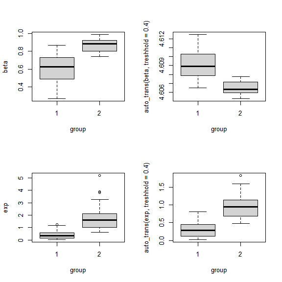
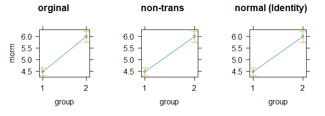
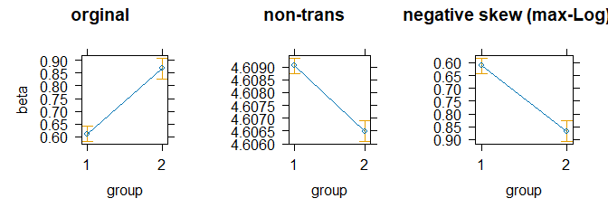
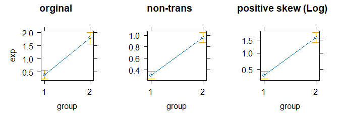
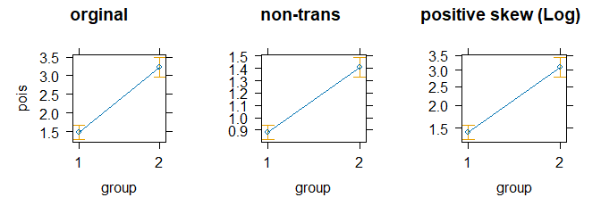

stp25tools
================

<!-- Attaching package: ‘stp25tools’ -->
<!-- The following objects are masked from ‘package:stp25aggregate’: -->
<!--     get_label, Label, set_label, wrap_label, XLS -->

## Funktionen

-   Pivot-Funktionen: *Long(), Wide(), Dapply(), dapply2(),
    transpose2()*

-   Zusammenfuegen von Data Frame: *Merge2, Rbind2, combine_data_frame*

-   Objekt in Data Frame umwandeln: *fix_to_df, fix_to_tibble,
    list_to_df*

-   Vectoren fuer den Zugriff auf Data Frame erstellen: *Cs, XLS,
    paste_names*

-   String umbrechen: *wrap_string*

-   Element zu Vectoren oder Listen hinzufuegen: *add_to, add_row_df*

-   Intern Daten mit Formel aufbereiten: *prepare_data2, print*

-   Vectoren transformieren: *as_numeric, as_factor, as_cut, as_logical,
    rev.factor,as_rev, cat_bmi*

-   Daten importieren: *get_data*

-   Fehlende Daten ergänzen und transformieren: *na_approx, auto_trans*

-   Label verwalten: *Label, delet_label, get_label, set_label*

-   Bereinigen von Data Frame und strings: *clean_names,
    cleansing_umlaute, cleansing_umlaute2*

-   Rechen operationen: *auc_trapezoid*

## Factor

``` r
factor2(c(1,0,0,0,1,1,0), 
        male = 1, female = 0)
```

    ## [1] male   female female female male   male   female
    ## Levels: male female

## Get Data

### Direkter Import aus Text

``` r
dat <-
  get_data("
sex treatment control
m  2 3
f  3 4
", tabel_expand = TRUE,id.vars = 1)

xtabs(~ sex + value, dat)
```

    ##    value
    ## sex control treatment
    ##   f       4         3
    ##   m       3         2

``` r
dat <- 
  get_data(
"sex treatment  neg  pos
f   KG          3   3
f   UG          4   5
m   KG          5   4
m   UG          4   2
",
  tabel_expand = TRUE,
  id.vars = 1:2,
  value = "befund"
)

ftable(xtabs(~ sex + treatment + befund, dat))
```

    ##               befund neg pos
    ## sex treatment               
    ## f   KG                 3   3
    ##     UG                 4   5
    ## m   KG                 5   4
    ##     UG                 4   2

### File Import

``` r
 file.exists("R/dummy.csv")
```

    ## [1] TRUE

``` r
#' get_data("R/dummy.csv", dec = ",", na.strings = "-", skip=1, label=1)
#' get_data("R/dummy.xlsx", na.strings = "-")
 get_data("R/dummy.xlsx")
```

    ## # A tibble: 5 × 5
    ##      id group.student x         y     z
    ##   <dbl> <chr>         <chr> <dbl> <dbl>
    ## 1     1 A             1      4.3   59.4
    ## 2     2 B             4      3.24  47.3
    ## 3     3 C             8      4.02  32.2
    ## 4     4 D             -      1.25  NA  
    ## 5     5 E             9      1.23  36.4

``` r
#' 
 x <- get_data("R/dummy.sav")
 get_label(x)[1:4]
```

    ##               lfdn      external.lfdn             tester           dispcode 
    ##           "number"    "external lfdn"           "tester" "disposition code"

## Transpose

### Wide

``` r
dat
```

    ##   month student  A B
    ## 1     1     Amy 19 6
    ## 2     2     Amy 27 7
    ## 3     3     Amy 16 8
    ## 4     1     Bob 28 5
    ## 5     2     Bob 10 6
    ## 6     3     Bob 29 7

``` r
df2<- dat %>% Wide(student,  c(A, B))
dat %>% Wide(student,  c("A", "B"))
```

    ## # A tibble: 3 × 5
    ##   month Amy_A Bob_A Amy_B Bob_B
    ##   <int> <dbl> <dbl> <dbl> <dbl>
    ## 1     1    19    28     6     5
    ## 2     2    27    10     7     6
    ## 3     3    16    29     8     7

``` r
dat[-3] %>% Wide(student,  B)
```

    ## # A tibble: 3 × 3
    ##   month   Amy   Bob
    ##   <int> <dbl> <dbl>
    ## 1     1     6     5
    ## 2     2     7     6
    ## 3     3     8     7

``` r
dat  %>% Wide(student ~ month)
```

    ## Using B as value column: use value to override.

    ## # A tibble: 2 × 4
    ##   student   `1`   `2`   `3`
    ##   <chr>   <dbl> <dbl> <dbl>
    ## 1 Amy         6     7     8
    ## 2 Bob         5     6     7

``` r
dat  %>% Wide(month ~ student, A)
```

    ## # A tibble: 3 × 3
    ##   month   Amy   Bob
    ##   <int> <dbl> <dbl>
    ## 1     1    19    28
    ## 2     2    27    10
    ## 3     3    16    29

``` r
dat  %>% Wide(student ~ month, A)
```

    ## # A tibble: 2 × 4
    ##   student   `1`   `2`   `3`
    ##   <chr>   <dbl> <dbl> <dbl>
    ## 1 Amy        19    27    16
    ## 2 Bob        28    10    29

### Long

``` r
df2
```

    ## # A tibble: 3 × 5
    ##   month Amy_A Bob_A Amy_B Bob_B
    ##   <int> <dbl> <dbl> <dbl> <dbl>
    ## 1     1    19    28     6     5
    ## 2     2    27    10     7     6
    ## 3     3    16    29     8     7

``` r
df2  %>% Long(Amy_A, Amy_B, Bob_A, Bob_B, by =  ~ month)
```

    ## # A tibble: 12 × 3
    ##    month variable value
    ##    <int> <fct>    <dbl>
    ##  1     1 Amy_A       19
    ##  2     1 Amy_B        6
    ##  3     1 Bob_A       28
    ##  4     1 Bob_B        5
    ##  5     2 Amy_A       27
    ##  6     2 Amy_B        7
    ##  7     2 Bob_A       10
    ##  8     2 Bob_B        6
    ##  9     3 Amy_A       16
    ## 10     3 Amy_B        8
    ## 11     3 Bob_A       29
    ## 12     3 Bob_B        7

``` r
dat %>%
  tidyr::gather(variable, value,-(month:student)) %>%
  tidyr::unite(temp, student, variable) %>%
  tidyr::spread(temp, value)
```

    ##   month Amy_A Amy_B Bob_A Bob_B
    ## 1     1    19     6    28     5
    ## 2     2    27     7    10     6
    ## 3     3    16     8    29     7

Das geht nicht Mehr:

``` {
#  df_w2 <- Wide(df, student, c("A", "B")))

 stp25aggregate::Long(
       list(A=c("Amy_A", "Bob_A" ), 
            B=c("Amy_B", "Bob_B")), 
       df2,
       by =  ~ month,
       key = "student",
       key.levels= c("Amy", "Bob"))
```

### Pivot-Transpose

``` r
dat
```

    ##   pos x y
    ## 1   A 1 3
    ## 2   B 2 4
    ## 3   C 3 5

``` r
transpose2(dat)
```

    ##   Item A B C
    ## x    x 1 2 3
    ## y    y 3 4 5

``` r
transpose2(
  dat,
  key = "Item",
  col.names = c("A-level", "C-level", "D-Level"),
  row.names = c("x-axis", "y-axis")
)
```

    ##     Item A-level C-level D-Level
    ## x x-axis       1       2       3
    ## y y-axis       3       4       5

## add_to

Element zu Liste hinzufügen.

``` r
add_to(list(a = 1:3, b = LETTERS[1:5]),
       c = 1, d = 2)
```

    ## $a
    ## [1] 1 2 3
    ## 
    ## $b
    ## [1] "A" "B" "C" "D" "E"
    ## 
    ## $c
    ## [1] 1
    ## 
    ## $d
    ## [1] 2

Element zu Data-Frame hinzufügen.

``` r
df <-   data.frame(
Source = c("A", "B", "C", "F"),
x = 1:4,
y = 1:4,
stringsAsFactors = FALSE
)

 add_to(df, c("Erste Zeile" = 1, "Dritte" = 3))
```

    ##        Source  x  y
    ## 5 Erste Zeile NA NA
    ## 1           A  1  1
    ## 2           B  2  2
    ## 6      Dritte NA NA
    ## 3           C  3  3
    ## 4           F  4  4

``` r
add_to(df, "Erste Zeile")
```

    ##        Source  x  y
    ## 5 Erste Zeile NA NA
    ## 1           A  1  1
    ## 2           B  2  2
    ## 3           C  3  3
    ## 4           F  4  4

``` r
add_to(df, c("Erste Zeile", "Zweite"))
```

    ##        Source  x  y
    ## 5 Erste Zeile NA NA
    ## 1           A  1  1
    ## 6      Zweite NA NA
    ## 2           B  2  2
    ## 3           C  3  3
    ## 4           F  4  4

``` r
add_to(df, c("Erste Zeile" = 1, "letzte" = 5))
```

    ##        Source  x  y
    ## 5 Erste Zeile NA NA
    ## 1           A  1  1
    ## 2           B  2  2
    ## 3           C  3  3
    ## 4           F  4  4
    ## 6      letzte NA NA

``` r
add_to(df, list("G", 5), pos = -1)
```

    ##   Source x  y
    ## 1      A 1  1
    ## 2      B 2  2
    ## 3      C 3  3
    ## 4      F 4  4
    ## 5      G 5 NA

``` r
add_to(df, data.frame(  Source = c("G", "H"),
                        x = 5:6
), pos = -1)
```

    ##   Source x  y
    ## 1      A 1  1
    ## 2      B 2  2
    ## 3      C 3  3
    ## 4      F 4  4
    ## 5      G 5 NA
    ## 6      H 6 NA

## cbind() und rbind()

``` r
df1 = data.frame(CustomerId = c(1:6), Product = c(rep("Oven", 3), rep("Television", 3)))
df2 = data.frame(CustomerId = c(4:7), Product = c(rep("Television", 2), rep("Air conditioner", 2)))
df3 = data.frame(
   CustomerId = c(4:7),
   Product = c(rep("Television", 2), rep("Air conditioner", 2)),
   State = c(rep("California", 2), rep("New Jersey", 2))
 )

 Rbind2(df1, df3)
```

    ##    which CustomerId         Product      State
    ## 1    df1          1            Oven       <NA>
    ## 2    df1          2            Oven       <NA>
    ## 3    df1          3            Oven       <NA>
    ## 4    df1          4      Television       <NA>
    ## 5    df1          5      Television       <NA>
    ## 6    df1          6      Television       <NA>
    ## 7    df3          4      Television California
    ## 8    df3          5      Television California
    ## 9    df3          6 Air conditioner New Jersey
    ## 10   df3          7 Air conditioner New Jersey

``` r
 #dplyr::bind_rows(df1, df2)
```

## merge()

``` r
n<-10
df1 <- 
  data.frame(
  origin = sample(c("A", "B", "C", "D", "E"), n, replace = T),
  N = sample(seq(9, 27, 0.5), n, replace = T),
  P = sample(seq(0.3, 4, 0.1), n, replace = T),
  C = sample(seq(400, 500, 1), n, replace = T))
df2 <-
  data.frame(
    origin = sample(c("A", "B", "C", "D", "E"), n, replace = T),
    foo1 = sample(c(T, F), n, replace = T),
    X = sample(seq(145600, 148300, 100), n, replace = T),
    Y = sample(seq(349800, 398600, 100), n, replace = T))
df3 <-
  data.frame(origin = sample(c("A", "B", "C", "D", "E"), n, replace = T))
df4 <-
  data.frame(origin = sample(c("A", "B", "C", "D", "E"), n, replace = T))

df1$id <- df2$id <- df3$id <- df4$id <- paste("P", sprintf("%02d", c(1:n)), sep = "")  
 
Merge2(df1, df2, df3, df4, by = "id")
```

    ##     id origin.x    N   P   C origin.y  foo1      X      Y origin.z origin.u
    ## 1  P01        A 18.0 0.7 426        A  TRUE 147600 383200        D        E
    ## 2  P02        E 20.5 3.1 490        A FALSE 145600 382500        D        D
    ## 3  P03        D 10.0 0.5 411        C  TRUE 147600 350100        A        C
    ## 4  P04        D 17.5 1.5 464        D FALSE 146700 370700        B        D
    ## 5  P05        C 12.5 2.3 408        D  TRUE 148100 364900        D        B
    ## 6  P06        C 23.5 2.9 442        D  TRUE 146400 371200        D        D
    ## 7  P07        D 17.5 2.2 456        B  TRUE 146200 375400        E        B
    ## 8  P08        E 22.0 0.3 468        E  TRUE 146600 361300        B        D
    ## 9  P09        C 11.0 1.7 485        B FALSE 146000 396200        E        B
    ## 10 P10        C 19.5 2.0 462        A  TRUE 147600 386600        B        E

## cbind data.frame aber listenweise

``` r
m <- data.frame(
  Item = 1:3,
  a = (1:3),
  b = (1:3) * 2,
  c = (1:3) * 3
)
sd <- data.frame(
  Item = (1:3),
  a = (1:3) * 4,
  b = (1:3) * 5,
  c = (1:3) * 6
)
combine_data_frame(m, sd)
```

    ##   Item a_m a_sd b_m b_sd c_m c_sd
    ## 1    1   1    4   2    5   3    6
    ## 2    2   2    8   4   10   6   12
    ## 3    3   3   12   6   15   9   18

``` r
combine_data_frame(m, sd, by = NULL)
```

    ##   Item_m Item_sd a_m a_sd b_m b_sd c_m c_sd
    ## 1      1       1   1    4   2    5   3    6
    ## 2      2       2   2    8   4   10   6   12
    ## 3      3       3   3   12   6   15   9   18

## list_to_df

``` r
x <- list(
  M1 = data.frame(
    Source = c("Intercept", "A", "B" , "C", "Residual"),
    b = c(0, 1, 2, 3, 0),
    y = c((1:4) + 10, 0)
  ),

  M2 = data.frame(
    Source = c("Intercept", "A", "C", "B",  "D",  "E", "Residual"),
    x = c(0, 1, 3, 2, 4, 5, 0),
    y = c((1:6) + 21, 0)
  ),
  M3 = data.frame(
    Source = c("A", "B", "C", "D", "Residual"),
    x = c((1:4), 0),
    y = c((1:4) + 20, 0)
  ),

  M1 = data.frame(
    Source = c("A", "B",  "D", "Residual"),
    x = c(1, 2, 4, 0),
    y = c((1:3) + 30, 0)
  )

)

# Spezialfall
list_to_df(x, last = "Residual")
```

    ##      Source M1_b M1_y M2_x M2_y M3_x M3_y M1.1_x M1.1_y
    ## 1 Intercept    0   11    0   22   NA   NA     NA     NA
    ## 2         A    1   12    1   23    1   21      1     31
    ## 3         B    2   13    2   25    2   22      2     32
    ## 4         C    3   14    3   24    3   23     NA     NA
    ## 6         D   NA   NA    4   26    4   24      4     33
    ## 7         E   NA   NA    5   27   NA   NA     NA     NA
    ## 5  Residual    0    0    0    0    0    0      0      0

``` r
fix_to_df(x)
```

    ##      Source M1_b M1_y M2_x M2_y M3_x M3_y M1.1_x M1.1_y
    ## 1 Intercept    0   11    0   22   NA   NA     NA     NA
    ## 2         A    1   12    1   23    1   21      1     31
    ## 3         B    2   13    2   25    2   22      2     32
    ## 4         C    3   14    3   24    3   23     NA     NA
    ## 5  Residual    0    0    0    0    0    0      0      0
    ## 6         D   NA   NA    4   26    4   24      4     33
    ## 7         E   NA   NA    5   27   NA   NA     NA     NA

``` r
data(infert, package = "datasets")
infert$case  <- factor(infert$case ,1:0, c("case", "control") )

#infert$spontaneous <- factor(infert$spontaneous)
#infert$induced2    <- factor(infert$induced==0)
# tab_1<- xtabs(~  case, infert)
# tab_2x2<- xtabs(~ induced2 + case, infert)
tab_3x2<- xtabs(~ induced + case, infert)
# tab_3x3<- xtabs(~ induced + education, infert)
# tab_3x3x2<- xtabs(~ induced + education+case, infert)
# tab_3x2x3<- xtabs(~ induced +case+ education, infert)
 
tab_3x2
```

    ##        case
    ## induced case control
    ##       0   47      96
    ##       1   23      45
    ##       2   13      24

``` r
fix_to_df(tab_3x2)
```

    ##   induced case_case case_control
    ## 1       0        47           96
    ## 2       1        23           45
    ## 3       2        13           24

## auto_trans

Automatische Taranformation von numerischen Variablen entsprechend ihere
Verteilungseigenschaft

``` r
x <- c(1, 1, 1, 1, 2, 2, 2, 2, 3, 3, 3, 3, 3, 3, 7, 7, 7, 7, 9, 20, 30)
x_trans<-auto_trans(x)
auto_trans(x_trans)
```

    ##  [1]  1  1  1  1  2  2  2  2  3  3  3  3  3  3  7  7  7  7  9 20 30
    ## attr(,"name")
    ## [1] "Re-trans"

``` r
x <- 100 - x
auto_trans(x)
```

    ##  [1] 0.6931472 0.6931472 0.6931472 0.6931472 1.0986123 1.0986123 1.0986123
    ##  [8] 1.0986123 1.3862944 1.3862944 1.3862944 1.3862944 1.3862944 1.3862944
    ## [15] 2.0794415 2.0794415 2.0794415 2.0794415 2.3025851 3.0445224 3.4339872
    ## attr(,"link")
    ## function(x)
    ##   log(101 - x)
    ## <bytecode: 0x00000233be69fd68>
    ## <environment: namespace:stp25tools>
    ## attr(,"inverse")
    ## function(x)
    ##   101 - (exp(x))
    ## <bytecode: 0x00000233be69c988>
    ## <environment: namespace:stp25tools>
    ## attr(,"name")
    ## [1] "negative skew (max-Log)"

``` r
par(mfrow=c(2,2))

boxplot(beta~group, dat)
boxplot(auto_trans(beta, treshhold = .4)~group, dat)
boxplot(exp~group, dat)
boxplot(auto_trans(exp, treshhold = .4)~group, dat)
```

<!-- -->

``` r
#boxplot(weibull~group, dat)
#boxplot(unif~group, dat)
```

``` r
for(i in 1:4){

  dat$x<- dat[[i]]
  fit0 <- lm(x~ group, dat)
  dat$x<- auto_trans(dat$x, treshhold = .4)
  fit1 <- lm(x~ group, dat)


  p0<-plot(effects::effect("group", fit0),
           main="orginal",
           ylab = names(dat)[i])
  p1<-plot(effects::effect("group", fit1),
           main="non-trans",
           ylab = "")
  p2<-plot(effects::effect("group", fit1,
                  transformation =
                    list(link = attr(dat$x, "link"),
                         inverse = attr(dat$x, "inverse"))),
           main=attr(dat$x, "name"),
           ylab = ""
           )
   gridExtra::grid.arrange(p0, p1, p2, ncol = 3)
}
```

<!-- --><!-- --><!-- --><!-- -->
